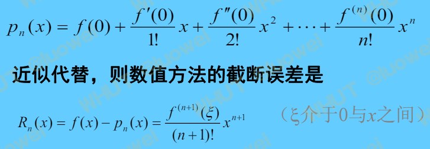
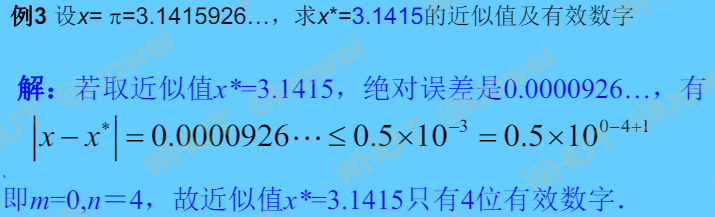
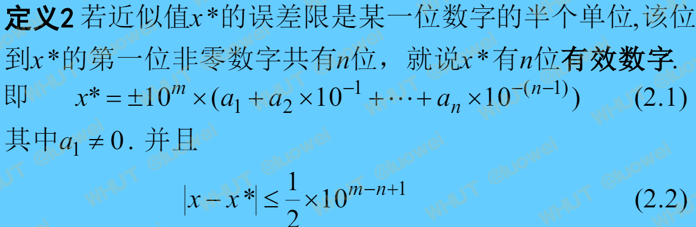

<!-- toc -->

# 0.误差分类
1. 模型误差：实际问题抽象成数学模型产生的误差
2. 观测误差
3. 截断误差：精确公式用近似公式代替时产生的误差

4. 舍入误差：用有限位数字代替精确数产生的误差

# 1.误差相关定义

# 2.有效数字定义

# 3.判断近似数的有效数字位数
  按照有效数字的定义，设近似数的总位数为n，将近似数的最后一位与真实数对比。
  如果近似数的最后一位符合四舍五入的规则，则其有效数字位数为n，否则其有效数字位数为n-1。
当最后一位正好为5时，四舍五入的结果为偶数，则其有效数字位数为n-1；当最后一位为奇数时，四舍五入的结果为奇数，则其有效数字位数为n。

