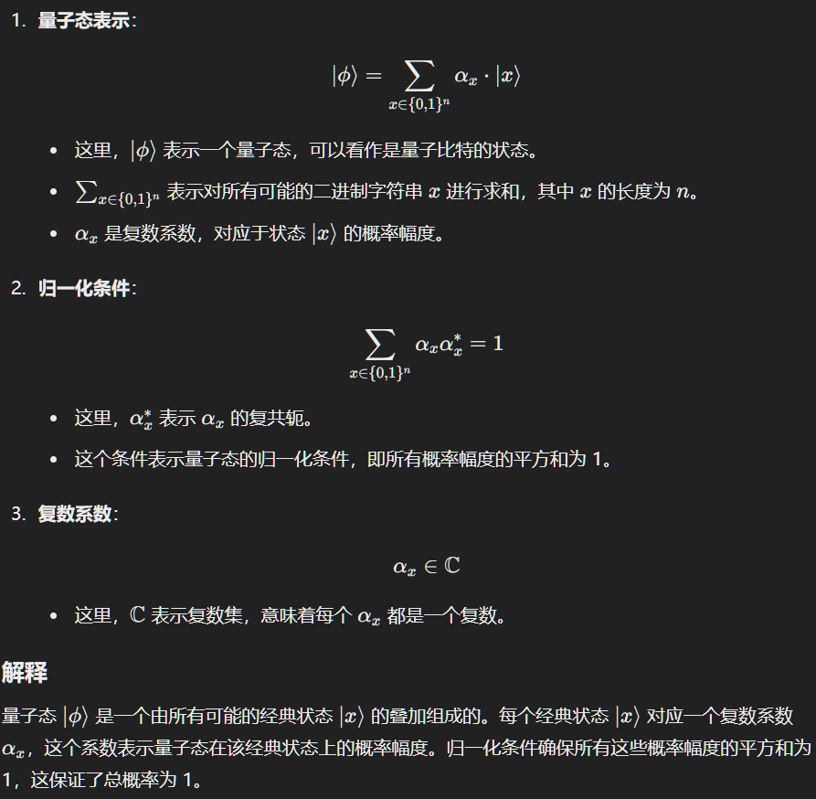
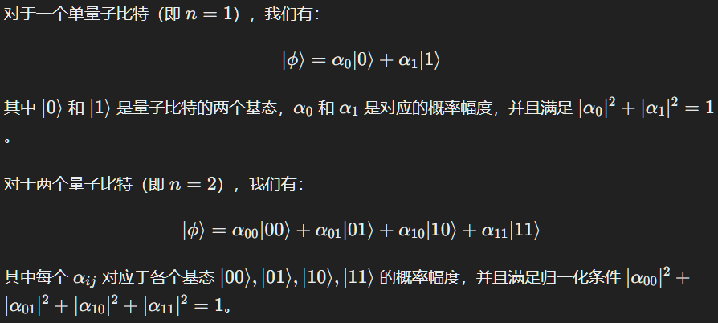
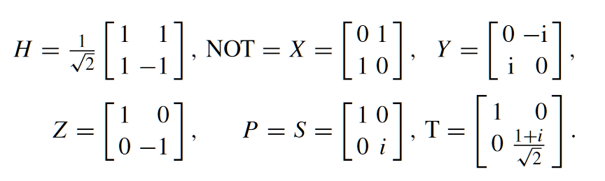
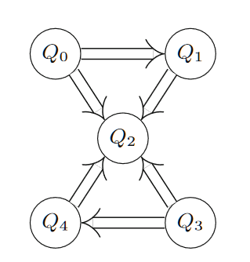
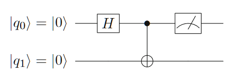
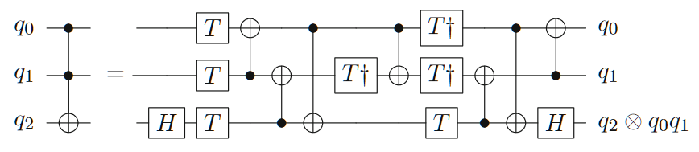
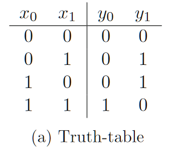
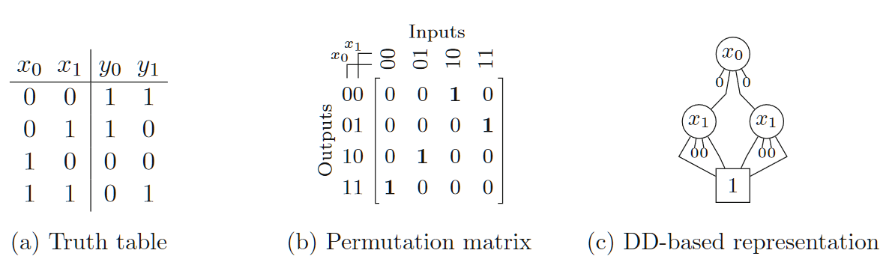

<!-- toc -->

<link rel="stylesheet" type="text/css" href="../style.css">

# Part I \- Introduction and Background
# 1 Introduction
## 背景

我们最终可能会得到强大的量子硬件，但没有有效的工具来充分利用这种力量。IBM、Google、Microsoft、Rigetti等公司开发了许多工具来帮助开发人员和研究人员制造量子计算应用,但都没有提供与传统领域一样强大的设计方法集合，也没有涵盖类似的广泛设计任务。

## 量子位
- |0〉、|1〉、叠加态(α0 · |0〉 + α1 · |1〉),
- 量子位之间有纠缠效应，
- n量子位系统可以同时表示$2^n$个不同的值，传统的n位系统只能表示n个不同的布尔值，多出指数级。
## 量子电路模拟

 量子电路模拟通常构成计算上非常复杂的任务，因为每个量子门和每个量子态最终都由一个酉矩阵或状态向量表示，该矩阵或状态向量随着量子位的数量呈指数增长。事实上，应用于由 n 个量子位组成的量子态的每个量子操作都需要将 $2^n \times 2^n $维矩阵与 $2^n$ 维向量相乘。这构成了严重的瓶颈，阻碍了许多量子应用的模拟。

## 量子电路编译
- 布尔组件的设计：涉及可逆电路合成的自动化方法，复杂性指数级。
- 映射到 NISQ 设备：要在真实硬件上运行量子电路，必须将它们映射到目标架构。第一步，要映射的电路的门被分解为目标硬件或某个门库中可用的基本操作。通常，该门库包含单个两量子位门与各种单量子位门结合，从而实现通用量子计算。然后，量子电路的逻辑量子位被映射到量子计算机的物理量子位——这是一项艰巨的任务，因为目标架构给出的连接限制禁止某些量子位对之间的交互。这通常可以通过插入进一步动态更改量子位映射的操作来解决，从而产生 NP 完全任务。
## 开发环境
- IBM’s Qiskit
- Google’s Cirq
- Microsoft’s Quantum Development Kit
- Rigetti’s Forest[]
# 2 Quantum Computing

本章提供了量子计算、量子和可逆电路以及当前开发的量子硬件（即 NISQ 设备）的背景知识。在此背景下，还介绍了本书中使用的符号和命名约定。

## 2.1 Quantum States and Operations
### 量子态：

公式解释：

例子：

量子态$|\psi\rangle$也可以用列向量表示：

$
\varphi=[\varphi_i] \\
其中,0\leq i <2^n,\varphi_i=\alpha_x, nat(x)=i
$

例子：

    
    

这个例子展示了如何通过测量量子系统的不同部分来确定其概率 新的状态。在量子计算中，测量不仅影响系统的状态，还决定了 统坍缩到特定基态的概率。每次测量都会根据概率幅度改变系统 状态。

### 量子门：
单量子位门：

双量子位门：

n量子位的运算操作可以表示为一个$2^n \times 2^n $ 维的酉矩阵。门操作都是可逆的，用于改变量子位的状态，门操作必须是幺正的。

## 2.2 Current and Future Quantum Technology
### IBM NISQ devices
- 设备：Noisy Intermediate-Scale Quantum (NISQ) devices
- IBM 的量子芯片使用与共面波导总线谐振器连接的超导量子位（基于约瑟夫森结，量子操作是通过向量子位施加微波脉冲来进行的。这样，所有这些设备都具有相同（或至少相似）的物理约束，在其上运行量子算法（即量子电路）时必须满足这些约束。
- 虽然单量子位门的应用不受限制，但各自开发的量子计算机的物理架构（通常是线性或矩形的量子位阵列）将两量子位门限制为通过超导总线谐振器连接的相邻量子位 。在使用交叉共振相互作用作为 CNOT 门基础的 IBM 设备中，量子计算量子位的频率也决定了门的方向（即确定哪个量子位是控制，哪个量子位是目标）。

图中展示了IBM设备的耦合图，有箭头连接的两个量子位(Qi,Qj)表明可以应用具有控制量子位 Qi 和目标量子位 Qj 的 CNOT 门。

## 2.3 Reversible and Quantum Circuits

    
    

图中展示了量子电路，量子位垂直分布，水平线表示时间轴，时间轴的各种符号表示要应用的门，单线表示受控操作。

# 3 Design Automation Methods for Conventional Systems
## 3.1 Decision Diagrams(决策图)

 二进制决策图是一种图形表示方法，用于表示布尔函数,决策图由节点和边组成，节点表示布尔变量，边表示布尔函数的取值。

布尔函数：

    
    

<table style="width: 100%;border: none;">
  <tr>
    <td style="text-align: left; border: none;">真值表</td>
    <td style="text-align: right;border: none;">二叉决策图Binary Decision Diagram  (实边表示取值为1，虚边表示取值为0)</td>
  </tr>
</table>

## 3.2 Heuristic Search Methods
A_star算法,略
## 3.3 Efficient Reasoning Engines
Boolean satisfiability (SAT) solvers，略
# Part-II Quantum-Circuit Simulation
本质是大规模矩阵乘法，需要大量内存，转换为决策图(DD)去优化解决。
# 4 Overview
# Part-III Design of Boolean Components for Quantum Circuits
本质是实现布尔函数，可逆电路的逻辑综合方法,也可基于决策图去优化。复杂性指数级。

# Part-IV Mapping Quantum Circuits to NISQ Devices

 量子电路的映射是将量子电路的逻辑门映射到目标硬件或某个门库中可用的基本操作的过程。量子电路的映射过程通常涉及两个步骤：

- 量子电路的逻辑门分解：将量子电路的门分解为目标硬件或某个门库中可用的基本操作。
- 量子位映射：将量子电路的逻辑量子位映射到量子计算机的物理量子位。

量子位映射是一项艰巨的任务，因为目标架构给出的连接限制禁止某些量子位对之间的交互。这通常可以通过插入进一步动态更改量子位映射的操作来解决，从而产生 NP 完全任务。这会引入一些辅助比特位和swap门，以便在量子电路的逻辑量子位与物理量子位之间建立映射。评价指标是电路的深度和使用的比特数量。