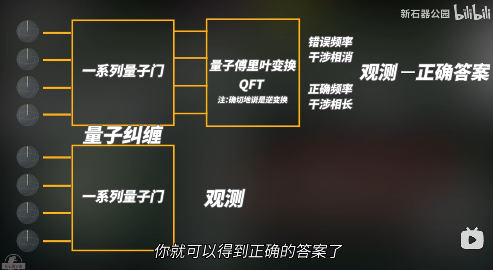

<!-- toc -->
<link rel="stylesheet" type="text/css" href="../style.css">

# 傅里叶变换

傅里叶变换（Fourier transform）是指将一个函数从时域变换到频域的过程。公式如下：

$F(w) = \int_{-\infty}^{\infty} f(t) e^{-i wt} dt \\ e^{-i wt} = \cos(wt) + i \sin(wt)$

其中，$f(t)$是时域函数，$F(w)$是频域函数，$i$是虚数单位,$w$是弧度间隔即频率。

几何解释：

将 $ f(t) $ 乘以 $ e^{-iwt} $，可以看作是将 $ f(t) $ 映射到复平面上，并旋转一个角度 $ -wt $。此时，$ f(t)e^{-iwt} $ 是一个复数，其实部和虚部分别表示信号在不同频率上的正弦和余弦分量的投影。积分的作用是衡量f(t)在频率w的综合贡献，例如当 $F(w)$ 最大时，对应的 $w$ 是 $f(t)$ 的主频率（或基频），这通常是信号中最强的频率成分。

# 量子傅里叶变换

量子傅里叶变换（quantum Fourier transform，QFT）是指将一个量子态从时域变换到频域的过程，一般是离散的，量子傅里叶变换的公式如下：

$|\tilde{\mathbf{x}}>=\frac1{\sqrt{\mathbf{N}}}\sum_{y=0}^{N-1}\mathbf{e}^{\frac{2\pi\mathbf{i}}N\times\mathbf{y}}|\mathbf{y}>$

其中，$|\mathbf{y}>$ 是 $N$ 个量子态的基态，系数表示概率
几何解释：