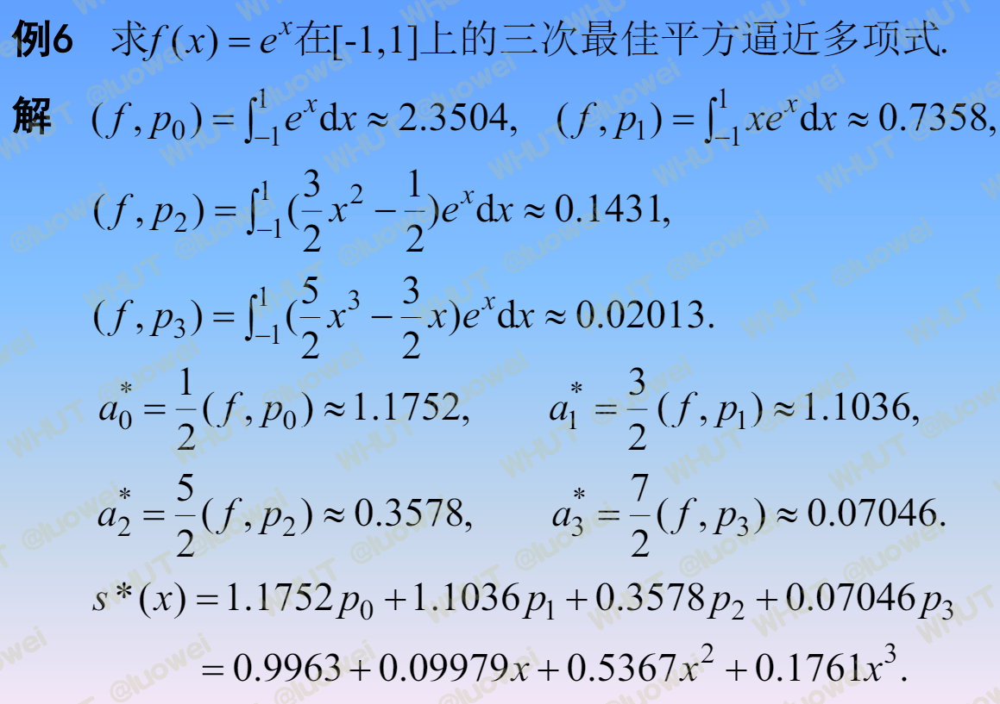
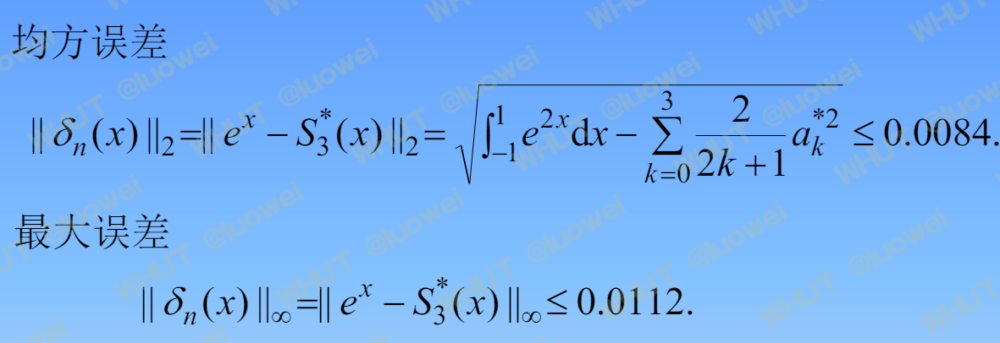

<!-- toc -->

# 1.函数逼近的基本概念

## 函数逼近与函数空间

### 函数空间：

- $ R^n = \left\{ \begin{pmatrix} x_1 \\ x_2 \\ \vdots \\ x_n \end{pmatrix} : x_i \in \mathbb{R} \right\}表示 n 维实数向量空间。$
- $R_n[x]=\{f(x):x\in R^n\} 表示表示系数在实数域上的 n 次多项式空间。$
- $\mathcal{C}[a,b] = \left\{ f: [a,b] \rightarrow \mathbb{R} \right\} 表示区间 [a,b] 上所有连续函数空间。$
- $\mathcal{C}^p[a,b] = \left\{ f: [a,b] \rightarrow \mathbb{R}^p \right\} 表示在区间 [a, b] 上具有连续 p 阶导数的函数空间。$
- $S = span\{x_1,x_2,\cdots,x_n\}：S 是由x_1,x_2,\cdots,x_n 生成的向量空间（线性组合的集合）。$
- $ H_n = span\{1,x,\cdots,x^n\}：H_n是由1,x,x^2,\cdots,x^n 生成的多项式空间。$

### 维度：

$R^n$ 的维度为 $n$，$R_n[x]$ 的维度为 $n+1$，$\mathcal{C}[a,b]$ 的维度为无穷，$\mathcal{C}^p[a,b]$ 的维度为 $p$。

有限维空间 vs 无限维空间：如果一个空间的基是有限的（有有限个基向量），则称为有限维空间，否则称为无限维空间。

### 线性相关与无关

设集合S是数域P上的线性空间，元素$x_1,x_2,...,x_n in S$，如果存在不全为0的数$a_1,a_2,...,a_n \in P$，使得
$a_1x_1+a_2x_2+\cdots+a_nx_n=0$,则称$x_1,x_2,...,x_n$线性相关。否则只对$a_1=a_2=\dots=a_n=0$才成立，则称$x_1,x_2,...,x_n$线性无关。

### 函数逼近

对于函数类A中的函数 $f(x)$，要求在另一类较简单的函数类$B\subset A$中找到一个函数 $p(x)$，使得 $p(x)$与 $f(x)$的误差在某种度量意义下最小。即：

$
对f(X) \in \mathcal{C}[a,b],求\varphi(x) \in \Phi=span\{\varphi_0,\varphi_1,\cdots,\varphi_n\} ,使得误差f(x)-\varphi(x)在某种度量意义下最小.其中，\varphi_0, \varphi_1, \cdots, \varphi_n \in \mathcal{C}[a,b]线性无关。
$

## 范数

对$R^n$中的向量$x=(x_1,x_2,\cdots,x_n)^T$，$\|x\|_p$表示向量$x$的p范数,有三种常用的范数：

- 1-范数：$\|x\|_1=\sum\limits_{i=1}^n|x_i|$

- 2-范数：$\|x\|_2=\left({\sum\limits_{i=1}^n|x_i|^2}\right)^{\frac{1}{2}}$

- $\infty$-范数或最大范数：$\|x\|_{\infty}=\max\limits_{1\leq i \leq n}|x_i|$

类似的，对于$C[a,b]$中的函数$f(x)$，$\|f\|_p$表示$f$的$p$范数，可定义三种常用的范数：

- 1-范数：$\|f\|_1=\int_a^b|f(x)|dx$

- 2-范数：$\|f\|_2=\left(\int_a^b|f(x)|^2dx\right)^{\frac{1}{2}}$

- $\infty$-范数：$\|f\|_{\infty}=\max\limits_{a\leq x\leq b}|f(x)|$

## 向量内积/Gram矩阵

### 内积

$R^n中向量\mathbf x,\mathbf y$的内积定义为：$(\mathbf x,\mathbf y)=\sum\limits_{i=1}^n x_iy_i$

加权内积：$(\mathbf x,\mathbf y)=\sum\limits_{i=1}^n \omega_i x_iy_i$

### 内积空间

设$\mathbf X$为一个内积空间，$\mathbf u_1,\mathbf u_2,\cdots,\mathbf u_n$为$\mathbf X$中的向量,矩阵G称为Gram矩阵，定义为：

$
G=\left[\begin{array}{}
(\mathbf u_1,\mathbf u_1) & (\mathbf u_2,\mathbf u_1) & \cdots & (\mathbf u_n,\mathbf u_1) \\
(\mathbf u_1,\mathbf u_2) & (\mathbf u_2,\mathbf u_2) & \cdots & (\mathbf u_n,\mathbf u_2) \\
\vdots & \vdots & \ddots & \vdots \\
(\mathbf u_1,\mathbf u_n) & (\mathbf u_2,\mathbf u_n) & \cdots & (\mathbf u_n,\mathbf u_n) \\
\end{array}\right]
$

G非奇异的充要条件是$\mathbf u_1,\mathbf u_2,\cdots,\mathbf u_n$线性无关。

在内积空间$\mathbf X$上可以由内积导出一种范数，即对$\mathbf u \in \mathbf X : \|\mathbf u\|_2=\sqrt{(\mathbf u, \mathbf u)}$。

## 函数内积/权函数/Gram矩阵

设$f(x),g(x) \in \mathbf C[a,b]$，$\rho(x)$为$[a,b]$上的权函数，则可定义内积：

$
(f,g)=\int_a^b \rho(x) f(x)g(x)dx
$

并导出范数：

$
\|f\|_2=\left(\int_a^b \rho(x) |f(x)|^2 dx\right)^{\frac{1}{2}}
$

设$\varphi_0,\cdots,\varphi_n \in \mathbf C[a,b]$,则Gram矩阵为：

$
G=\left[\begin{array}{}
(\varphi_0,\varphi_0) & (\varphi_0,\varphi_1) & \cdots & (\varphi_0,\varphi_n) \\
(\varphi_1,\varphi_0) & (\varphi_1,\varphi_1) & \cdots & (\varphi_1,\varphi_n) \\
\vdots & \vdots & \ddots & \vdots \\
(\varphi_n,\varphi_0) & (\varphi_n,\varphi_1) & \cdots & (\varphi_n,\varphi_n) \\
\end{array}\right]
$

# 2.正交多项式

## 正交函数族与正交多项式

### 函数正交

若$f(x),g(x)$都是$C[a,b]$中的连续函数，$\rho(x)$为[a,b]上的权函数，且$(f,g)=\int_a^b \rho(x) f(x)g(x)dx=0$，则称$f(x),g(x)$在[a,b]上带权$\rho(x)$正交，记作$f(x) \perp g(x)$。
### 正交函数族
设在[a,b]给定函数族$\varphi_1(x),\varphi_2(x),\cdots,\varphi_n(x)$,满足：

$
(\varphi_i(x),\varphi_j(x))=
\left\{\begin{array}{}
0,i\neq k \\
A_k,i=k
\end{array}\right.
\quad (i,k=0,1,2,\cdots,n)
$

则称函数族$\{\varphi_1(x),\varphi_2(x),\cdots,\varphi_n(x)\}$为[a,b]上的正交函数族。特别的当$A_k=1$时，称标准正交函数族。

### 正交多项式

若多项式序列$\{p_n(x)\}_0^{\infty}$满足带权$\rho(  x)$的[a,b]上的正交性，则称$\{p_n(x)\}_0^{\infty}$为以$\rho(x)$为权函数[a,b]上的正交多项式序列，称$p_n(x)$为以$\rho(x)$为权函数的[a,b]上的n次正交多项式。
非重点，性质略。

## 常用正交多项式

这里仅记载一个常用的正交多项式求法：

- 勒让德多项式：
  - $P_0(x)=1, $
  - $P_1(x)=x, $
  - $P_{n+1}(x)=\frac{(2n+1)}{n+1}xP_n(x)-\frac{n}{n+1}P_{n-1}(x)$

- 勒让德、切比雪夫、第二类切比雪夫、拉盖尔、埃尔米特正交多项式非重点略。

# 3.最佳一致逼近多项式
非重点略

# 4.最佳平方逼近

## 函数的最佳平方逼近

设$f(x) \in C[a,b]$上连续，$f(x)$在[a,b]上的$n$次最佳平方逼近多项式$s^*(x)=\sum\limits_{j=0}^n a_j^* x^j$满足：

$
\int_a^b [f(x)-s^*(x)]^2 dx = \min\limits_{s(x) \in H_n} \int_a^b [f(x)-s(x)]^2 dx
$

设$f(x) \in C[a,b],\Phi=span\{\varphi_0,\varphi_1,\cdots,\varphi_n\} \subset C[a,b]$，$f(x)$在集合$\Phi$上的最佳平方逼近函数$s^*(x)$满足：

$
\int_a^b \rho(x) [f(x)-s^*(x)]^2 dx = \min\limits_{s(x) \in \Phi} \int_a^b \rho(x) [f(x)-s(x)]^2 dx
$

求解：

问题归结于求$s^*(x)=\sum\limits_{j=0}^n a_j^* \varphi_j$的系数$a_j^*$，使得：

$
I(a_0,a_1,\cdots,a_n)=\int_a^b \rho(x)[f(x)-\sum\limits_{j=0}^n a_j^* \varphi_j]^2 dx
$

取得最小值，即极值处的导数为0：

$
\frac{\partial I(a_0,a_1,\cdots,a_n)}{\partial a_k}=2\int_a^b \rho(x) [f(x)-\sum\limits_{j=0}^n a_j^* \varphi_j] \varphi_k dx=0
$

即：

$
(f(x)-\sum\limits_{j=0}^n a_j^* \varphi_j,\varphi_k)=0\quad k=0,1,2,\cdots,n
$

继而可得方程组即法方程：

$
\left[\begin{array}{}
(\varphi_0,\varphi_0) & (\varphi_0,\varphi_1) & \cdots & (\varphi_0,\varphi_n) \\
(\varphi_1,\varphi_0) & (\varphi_1,\varphi_1) & \cdots & (\varphi_1,\varphi_n) \\
\vdots & \vdots & \ddots & \vdots \\
(\varphi_n,\varphi_0) & (\varphi_n,\varphi_1) & \cdots & (\varphi_n,\varphi_n) \\
\end{array}\right]
\left[\begin{array}{}
a_0^* \\
a_1^* \\
\vdots \\
a_n^*   
\end{array}\right]=
\left[\begin{array}{}
(f,\varphi_0)\\
(f,\varphi_1)\\
\vdots \\
(f,\varphi_n)   
\end{array}\right]
$

平方误差：

$
\|\delta(x)\|_2^2=(f-s^*,f-s^*)=(f,f)-(f,s*)=\|f(x)\|_2^2-\sum\limits_{k=0}^n a_k^*(f,\varphi_k)
$

例题：

## 用正交函数族求最佳平方逼近

设$f(x) \in C[a,b]$，$\Phi=span\{\varphi_1(x),\varphi_2(x),\cdots,\varphi_n(x)\}$,$\varphi_0,\varphi_1,\cdots,\varphi_n$为正交函数族,则法方程：

$
\left[\begin{array}{}
(\varphi_0,\varphi_0) & 0 & \cdots & 0 \\
0 & (\varphi_1,\varphi_1) & \cdots & 0 \\
\vdots & \vdots & \ddots & \vdots \\
0 & 0 & \cdots & (\varphi_n,\varphi_n) \\
\end{array}\right]
\left[\begin{array}{}
a_0^* \\
a_1^* \\
\vdots \\
a_n^*   
\end{array}\right]=
\left[\begin{array}{}
(f,\varphi_0)\\
(f,\varphi_1)\\
\vdots \\
(f,\varphi_n)   
\end{array}\right]
$

可得：

$
a_k^*=(f,\varphi_k)/(\varphi_k,\varphi_k)\\
s_n^*(x)=\sum\limits_{k=0}^n a_k^* \varphi_k(x)=\sum\limits_{k=0}^n \frac{(f,\varphi_k)}{(\varphi_k,\varphi_k)} \varphi_k(x)=\sum\limits_{k=0}^n \frac{(f,\varphi_k)}{\|\varphi_k\|_2^2} \varphi_k(x)\\
平方误差：\|\delta(x)\|_2^2==\|f(x)\|_2^2-\sum\limits_{k=0}^n a_k^*(f,\varphi_k)
=\|f(x)\|_2^2-\sum\limits_{k=0}^n \frac{(f,\varphi_k)^2}{\|\varphi_k\|_2^2}
$

例题：

