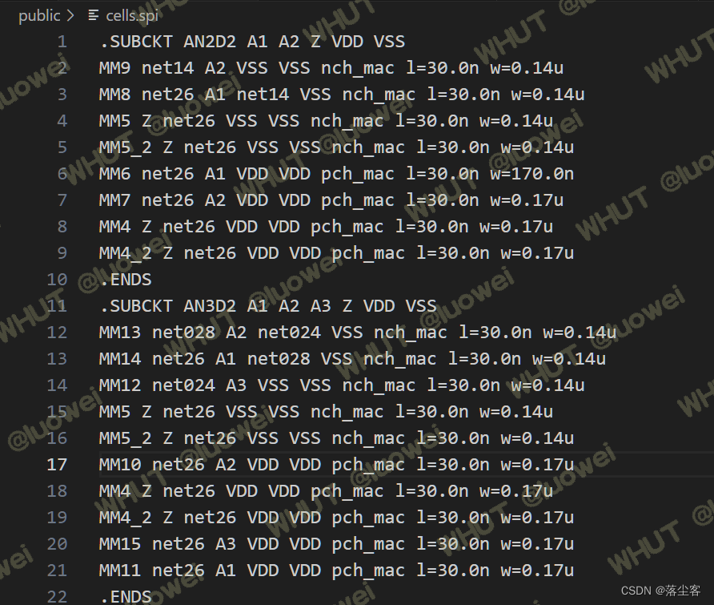
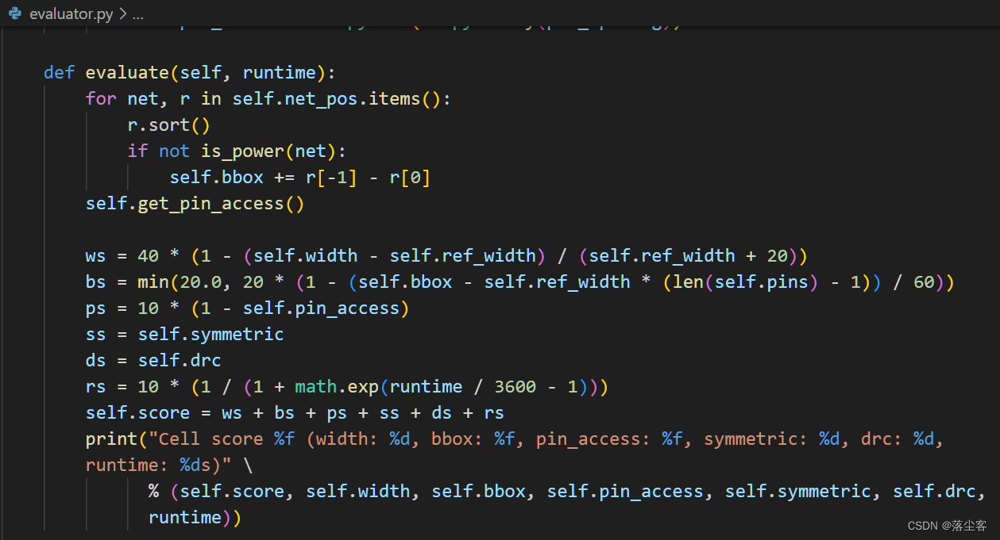
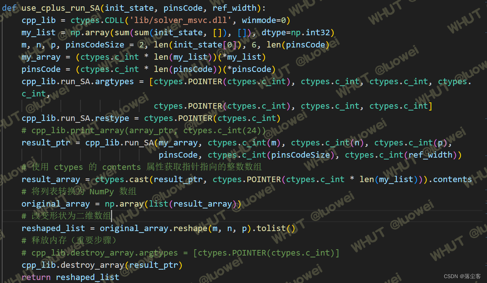
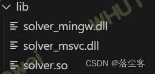
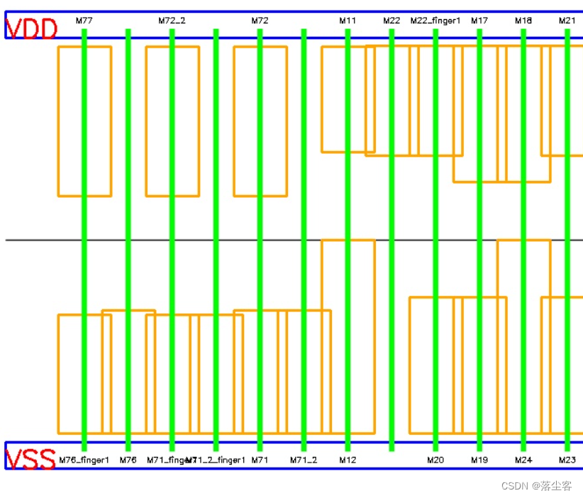
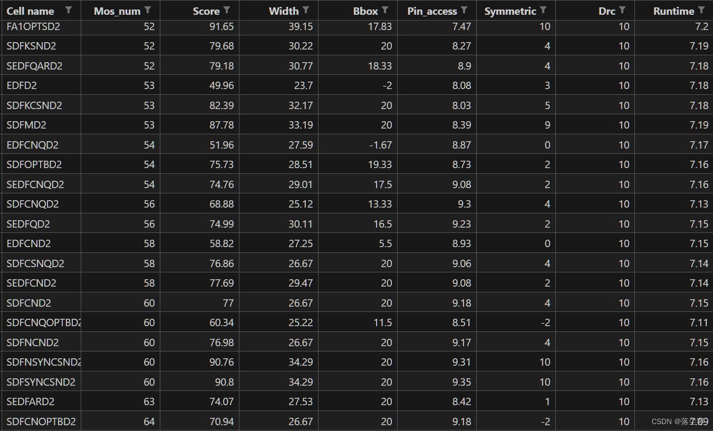

<!-- toc -->
<style>
.image {
  display: block;
  margin-left: auto;
  margin-right: auto;
  max-width: 500px; /* 根据需要调整宽度 */
  max-height: 400px; /* 根据需要调整高度 */
}
</style>

# 1.选题动机
 说到选题动机，首先肯定是基于所有选题大概都看了一下,选这个题大概有这几方面的原因：

- 对结果的期望

    实在的说，参加这个比赛的目的可能与这个比赛的举办愿景不一致！但学生嘛，一句话穷嘛，在合适的时间和精力代价下拿到尽量多的奖金肯定是第一动机，至于评优评先那都是后话了！这里不得不说，其实中国的很多竞赛对学生是很优待的，不冲着大奖去，冲着拿奖金的门槛去比对一般的同学来讲是不难的，在求学生涯中也是一笔不错的收入，感谢中国很多良心企业对这些比赛的支持！至于后面的动机就不太符合主流价值观了，既然第一目的是奖金，那肯定是没有抱着学习和增强能力的态度，选择竞争小、好拿奖的比赛和赛题才符合初衷，判断标准自然是去看一个比赛历史的<b>参赛人数、地域分布、获奖概率、奖金多少</b>等因素了！

- 自身基础
 
    谈到基础，对一些完全零基础的，最推荐的就是算法类题目，一方面基本的流程步骤、网上资料都比较齐全，一方面chatgpt这样的编程助手在，要敲出点程序做出个结果也是不难的！我个人目前就是这样的情况，看完十个赛题，首先就排除了涉及电路设计、仿真知识的赛题，不巧只剩下五、七、八、十四个赛题，通俗的话说这四个题分别是路径问题、分组问题、布局问题、F图形匹配问题，相关的问题经过搜索资料可知除最后一个需要图形处理相关的知识（AI\CV不好学，直接排除）其余只需要一些图论算法方面的知识！
 
- 题目难度
 
    于是，选了上述的三个题继续去理解，路径问题与FPGA布线相关，分组问题与存储器测试相关，布局问题则是晶体管布局相关!进一步分析，发现布局问题被抽象至一维、相关的数学建模赛题部分已经完善、测试case例子给出、打分程序代码公开，路径问题可以用一些常见的广度优先等算法解决、题目理解难度中等但需要给出的具体路径结果模糊不明，存储器测试相关问题则很难理解！
 
- 平台资源
  
     谈到这个资源主要分为个人平台资源和赛题方企业提供的资源，如果个人所在平台没有什么前人遗产或者已有项目成果基本就只能选择企业命题，不考虑基础差异，大家都是从头开始做！如果是自主命题，那基本是神仙打架，汤都没法喝，而且奖金分配权也是属于整个团队的！其次，选择了企业命题，企业提供的帮助也很重要，工程师是否乐意回答问题，题目的输入/输出是否明确、测试case是否给出、打分是否明确（赛题八有打分程序且公开程序自然是最香的，如果打分程序是个黑盒还可以去拟合拟合，如果是人为评分就很拼PPT了）都很重要！
 
综上，选题不能急，在报名之前对各个赛题了解的越深入越好，主要目的是在做题目之前预估自己能获得的成绩。报名截止之后，全力去做选中的题目！个人选赛题八，当然也有本人比较懒的原因，对PPT\技术文档之类的深恶痛觉，算个混子也不足为过，这就很依赖一个好队长了，我也是在考虑选这个题之后厚着脸去投靠干事靠谱的好基友！
# 2.方案制定

题目就不用多说了，比赛方也提供相应的论文：<span style="color:red">CMOS 单元版图生成中的晶体管布局算法</span>，复现就可以拿到一个很好的结果！算法采用的是模拟退火算法，当然也简单的使用了策略梯度下降的强化学习算法实验了一下。比较起来，强化学习算法可以做但需要继续深入学习，爬山法和模拟退火算法结果相近，模拟退火算法更加稳定，这里主要介绍使用这些算法的主要关键部分的实现方案! 个人理解无论哪种随机算法，都需要有一个解，其次需要有基于当前解或者随机产生新解的方法，实现对应的代码细节后续便可根据各种所谓的新颖、启发式算法步骤去控制最优解的寻找和产生过程，本质上传统算法都是一样的做法，这里只介绍最关键的部分，使用不同的算法去套用即可！许多细节未一一讲解，在代码中实现！

1. <b>解的形式</b>

这里只针对赛题八进行解释，算法的解无非就是一个经过设计的数据结构甚至可以看作是一个文件。比如赛题八提供了一个json格式的输出文件，把他当作解，可以根据文件内容反推出一个数据结构，使用正则表达式进行解析即可！当然这里可以直接使用python的标准模块反序列化成一个字典，算法的目标就是生成这样一个字典，自己可以通过结果反推定义解的初始形式，再编写相关代码输出结果文件，中间过程怎么方便怎么来！

我的做法比较简单粗暴，去掉不相干的，结合题意，用一个2*N*7的列表作为数据结构，小作坊做法不适合大的团队项目（好处就是：程序效率会提升！还可以用一个词典来编码每一个单词替换为int类型，继续提升效率，编码后还可以用结合c++动态库的方式来进一步提升效率，补全python运算慢的短板！其次，可以方便得作为深度网络的输入结合强化学习算法！做法会在代码实现中讲解)。当然直接采用类来实现数据结构也是可以的，但如何去优化效率可能是一个问题，赛题方似乎五分钟跑完所有case和两个小时给出的分数只相差0.1，那自然要让程序多飞一会儿比较好，随机搜索算法相同时间程序效率越高结果越好，需要有一个取舍！

2. <b>新解产生</b>

既然解是一个数组， 根据每一位数据的含义在符合规则的范围内修改这个数组即可，代码实现较为简单，这可能也是简单粗暴的好处了！实现论文这个部分只需要十几行代码即可！

3. <b>目标函数</b>

目标函数即对所给出的解进行打分，将上述数组正推转化得到题目要求的结果文件json，调用赛题给出的打分程序得到分数。这个过程可以看作目标函数的实现，为了方便调用和效率提升，需要将这个过程写成一个函数方法！这里采用将打分程序改写为c++编译为动态库和修改输入输出参数的方法来转化.

<span style="color:red">
综上，具体的方案即代码实现流程为：输入文件正则解析->编码->解数组->调用c++动态库求解分数->产生新解->采用某种算法迭代优化解数组->解码->JSON格式的结果文件，细节在代码中实现！</span>

# 3.代码撰写
## 0.赛题方提供资料


## 1. 输入文件解析
此处先对输入文件进行正则解析，并为每一个cell存取对应的mos数据并建立词典方便编解码.
​
```python
import re
import numpy as np
import copy
 
class Mos:
    # __slots__ = ('name', 'type', 'left', 'mid', 'right', 'w', 'l',)
 
    def __init__(self, name, left, mid, right, type, w, l):
        self.name = name
        self.left = left
        self.mid = mid
        self.right = right
        self.type = type
        self.w = w
        self.l = l
 
 
class Parser:
    def __init__(self) -> None:
        self.cell_dict = {}
        self.cell_pins_dict = {}
        self.cell_words_dict = {}
        self.cell_encode_dict = {}
        self.cell_decode_dict = {}
        self.cell_ref_width_dict = {}  # 记录布局理想宽度
        # self.attributes = ('name', 'type', 'left', 'mid', 'right', 'w', 'l')
        self.pattern = re.compile(r"(.*)\s(.*)\s(.*)\s(.*)\s.*\s(.*)\s(\w)=(.*\w)\s\w=(.*\w)\s*\n")
 
    def parse(self, path, cell_name):
        self.path = path
        if cell_name in self.cell_dict:
            print(f"{cell_name}已存在搜索记录")
            return self.cell_dict[cell_name], self.cell_pins_dict[cell_name]
        with open(self.path, 'r') as f:
            find_cell = False
            for line in f:
                words = line.split()
                if words[0] == ".ENDS" and find_cell:
                    break
                if words[0] == ".SUBCKT" and cell_name == words[1]:
                    find_cell = True
                    self.cell_pins_dict[cell_name] = [net for net in words[2:] if net.upper() not in ["VDD", "VSS"]]
                    self.cell_dict[cell_name] = []
                    self.cell_words_dict[cell_name] = []
                    self.cell_ref_width_dict[cell_name] = 0
                    continue
                if find_cell:
                    line_data = re.match(self.pattern, line)
                    if line_data:
                        name, left, mid, right, type, swap_wl, w, l = line_data.groups()
                        if swap_wl.upper() == 'L':
                            w, l = l, w
                        params = [name, left, mid, right, type, int(
                            float(w[:-1])*1000) if w[-1] == 'u' else int(float(w[:-1])), int(float(l[:-1])*1000) if l[-1] == 'u' else int(float(l[:-1]))]
                        self.cell_ref_width_dict[cell_name] += params[-2]//200 if params[-2] > 220 else 1
                        if params[-2] > 220:
                            if params[-2] % 2 == 0:
                                params[-2] = int(params[-2]/2)
                                self.cell_dict[cell_name].append(Mos(*params))
                                self.cell_words_dict[cell_name].append(copy.deepcopy(params))
                                params[0] += '_finger1'
                                self.cell_dict[cell_name].append(Mos(*params))
                                self.cell_words_dict[cell_name].append(params)
                            else:
                                params[-2] = int(params[-2]/2 + 2.5)
                                self.cell_dict[cell_name].append(Mos(*params))
                                self.cell_words_dict[cell_name].append(copy.deepcopy(params))
                                params[0] += '_finger1'
                                params[-2] -= 5
                                self.cell_dict[cell_name].append(Mos(*params))
                                self.cell_words_dict[cell_name].append(params)
                        else:
                            self.cell_dict[cell_name].append(Mos(*params))
                            self.cell_words_dict[cell_name].append(params)
        if not find_cell:
            print(
                f"未能成功在 {self.path} 中搜索到名为 {cell_name} 的cell,请重新确认输入参数!\nUsage:python main.py  -n <netlist> -c <cell_name> -o <save_path>")
            exit()
        return self.cell_dict[cell_name], self.cell_pins_dict[cell_name]
 
    def build_code_dict(self, cell_name):
        self.cell_encode_dict[cell_name] = {}
        words_list = np.array(self.cell_words_dict[cell_name])
        self.cell_encode_dict[cell_name]['name'] = dict(zip(words_list[:, 0], [i for i in range(1, len(words_list[:, 0])+1)]))  # 0表示虚拟mos
        nets = set(sum(words_list[:, 1:4].tolist(), []))
        if 'VDD' in nets:
            nets.remove('VDD')
        if 'VSS' in nets:
            nets.remove('VSS')
        self.cell_encode_dict[cell_name]['net'] = {'VSS': 0, 'VDD': 1}
        self.cell_encode_dict[cell_name]['net'].update(dict(zip(nets, [i for i in range(2, len(nets)+2)])))
        self.cell_decode_dict[cell_name] = {}
        self.cell_decode_dict[cell_name]['net'] = {value: key for key, value in self.cell_encode_dict[cell_name]['net'].items()}
        self.cell_decode_dict[cell_name]['name'] = {value: key for key, value in self.cell_encode_dict[cell_name]['name'].items()}
        return self.cell_encode_dict[cell_name], self.cell_decode_dict[cell_name]
```
## 2.编解码方法
```python
def encode(mos_list, encode_dict):
    """
    将字符串类型的mos管列表编码为int类型
    """
    mos_list_encode = {}  # 6维(name,y,left, mid, right,w)的n个晶体管
    for mos in mos_list:
        temp = []
        # for item in ['name','left', 'mid', 'right', 'type', 'w', 'l',]:
        for item in ['name', 'type', 'left', 'mid', 'right', 'w']:
            if mos.name == 0:
                code_number = 0
            elif item == 'name':
                code_number = encode_dict['name'][mos.name]
            elif item == 'left':
                code_number = encode_dict['net'][mos.left]
            elif item == 'mid':
                code_number = encode_dict['net'][mos.mid]
            elif item == 'right':
                code_number = encode_dict['net'][mos.right]
            elif item == 'type':
                code_number = 1 if mos.type == 'pch_mac' else 0
            elif item == 'w':
                code_number = mos.w
            elif item == 'l':
                code_number = mos.l
            temp.append(code_number)
        if temp[3] in mos_list_encode:
            mos_list_encode[temp[3]].append(temp)
        else:
            mos_list_encode[temp[3]] = [temp]
    pmos_list = []
    nmos_list = []
    for mid, temp in mos_list_encode.items():
        for mos in temp:
            if mos[1] == 1:
                pmos_list.append(mos)
            else:
                nmos_list.append(mos)
        dif = len(pmos_list) - len(nmos_list)
        if dif == 0:
            continue
        elif dif > 0:
            for i in range(dif):
                nmos_list.append([0, 0] + pmos_list[-1][2:])
        else:
            for i in range(abs(dif)):
                pmos_list.append([0, 1] + nmos_list[-1][2:])
    return [pmos_list, nmos_list]
 
def decode(mos_list_encode1, decode_dict):
    '''
    description : 将编码后的解还原成可以人工理解的json格式字典
    param        mos_list
    param        {*} mos_list_encode 6维(name,y,left, mid, right,w)的n个晶体管
    param        {*} decode_dict
    return       mos_list_decode #{"placement": {
                                                "M0": {"x": "0","y": "1","source": "VDD","gate": "A2","drain": "ZN","width": "200"},
                                                }
    '''
    mos_list_encode = copy.deepcopy(mos_list_encode1)
    for i in range(len(mos_list_encode[0])):
        if i == 0:
            unit_x = 0
        else:
            if (mos_list_encode[0][i-1][0]*mos_list_encode[0][i][0] == 0 or mos_list_encode[0][i-1][5] == mos_list_encode[0][i][2]) and (mos_list_encode[1][i-1][0]*mos_list_encode[1][i][0] == 0 or mos_list_encode[1][i-1][5] == mos_list_encode[1][i][2]):
                unit_x += 1
            else:
                unit_x += 2
        mos_list_encode[0][i].insert(1, unit_x)
        mos_list_encode[1][i].insert(1, unit_x)
    mos_list = sum(mos_list_encode, [])
    mos_list_decode = {"placement": {}}
    mos_list.sort(key=lambda x: x[1])
    for mos in mos_list:
        if mos[0] == 0:
            continue
        else:
            mos_list_decode['placement'][decode_dict['name'][mos[0]][1:]] = dict(zip(["x", "y", "source", "gate", "drain", "width"],
                                                                                     [str(i) for i in mos[1:3]]+list(map(lambda x: decode_dict['net'][x], mos[3:6]))+[str(mos[6])]))
    return mos_list_decode
```
## 3.目标函数实现
打开public\evaluator.py,可以直接简取其中的python代也可以转为c++再调用这里已经编写好接口。



## 4.新解产生实现
```python    
def sol_update(s_old, action):
    """ 根据action选择更新解的方式
        method 0:任选一个管对，移动该管对到新位置
        method 1:任选两个管对交换位置,输出每个管对需要被交换
        method 2:任选一个管对,改变该管对中一个或一对管子的放置方向
        ...
        return new_sol
    """
    # 创建一个新的的张量数组，用于存储交换后的结果
    s_new = copy.deepcopy(s_old)
    if action == 0:  # 随机选择一个管对，移动到新位置
        a = rd.randint(0, len(s_new[0])-1)
        b = rd.randint(0, len(s_new[0])-1)
        s_new[0].insert(b, s_new[0].pop(a))
        s_new[1].insert(b, s_new[1].pop(a))
    elif action == 1:  # 随机交换两个管对
        a = rd.randint(0, len(s_new[0])-1)
        b = rd.randint(0, len(s_new[0])-1)
        s_new[0][a], s_new[0][b] = s_new[0][b], s_new[0][a]
        s_new[1][a], s_new[1][b] = s_new[1][b], s_new[1][a]
    elif action == 2:  # 交换栅极相同的管子即重新配对
        channel_type = rd.randint(0, 1)
        a = rd.randint(0, len(s_new[0])-1)
        indexs = [i for i in range(len(
            s_new[channel_type])) if s_new[channel_type][i][3] == s_new[channel_type][a][3]]
        b = rd.choice(indexs)
        s_new[channel_type][a], s_new[channel_type][b] = s_new[channel_type][b], s_new[channel_type][a]
    elif action == 3:  # 随机选取一个管子旋转
        a = rd.randint(0, len(s_new[0])-1)
        channel_type = rd.randint(0, 1)
        s_new[channel_type][a][2], s_new[channel_type][a][4] = s_new[channel_type][a][4], s_new[channel_type][a][2]
    # elif action == 4:  # 交换相邻一处管对
    #     a = rd.randint(0, len(s_new[0])-1)
    #     b = a-1 if a > 0 else 1
    #     s_new[0][a], s_new[0][b] = s_new[0][b], s_new[0][a]
    #     s_new[1][a], s_new[1][b] = s_new[1][b], s_new[1][a]
    return s_new
```
## 5.结果可视化方法
``` python
import sys
    import json
    if len(sys.argv) < 2:
        print("ERROR: No placement file provided.")
        exit()
    placement_file = sys.argv[1]
    with open(placement_file, 'r') as f:
        placement_data = json.load(f)
    mos_lenth = 60
    unit = 50
    real_x_max = 100+unit*len(placement_data['placement'])
    result = numpy.full((640, real_x_max, 3), 255, numpy.uint8)
    mos_list = [Mos(name, int(mos['x']), int(mos['y']), mos['source'], mos['drain'], int(
        mos['width'])) for name, mos in placement_data['placement'].items()]
    # visulize
    cv2.rectangle(result, (10, 70), (real_x_max-10, 100), (255, 0, 0), 2)
    cv2.rectangle(result, (10, 560), (real_x_max-10, 590), (255, 0, 0), 2)
    cv2.putText(result, 'VDD', (10, 100), None, 1, (0, 0, 255), thickness=2, lineType=cv2.LINE_8, bottomLeftOrigin=None)
    cv2.putText(result, 'VSS', (10, 590), None, 1, (0, 0, 255), thickness=2, lineType=cv2.LINE_8, bottomLeftOrigin=None)
    cv2.line(result, (10, 330), (real_x_max-10, 330),
             (0, 0, 0), 1, cv2.LINE_AA)
    for mos in mos_list:
        real_x = mos.x*unit+100
        rect = ((real_x, 110+mos.width//2 if mos.y == 1 else 550 -
                mos.width//2), (mos_lenth, mos.width), 0)
        box = numpy.int32(cv2.boxPoints(rect))
        cv2.drawContours(result, [box], -1, (0, 165, 255), 2)
        rect = ((real_x, 330), (5, 480), 0)
        box = numpy.int32(cv2.boxPoints(rect))
        cv2.drawContours(result, [box], -1, (0, 255, 0), -1)
        text_size, _ = cv2.getTextSize(mos.name, None, 0.3, 1)
        cv2.putText(result, mos.name, (real_x-text_size[0]//2, 80+text_size[1]//2 if mos.y == 1 else 580 +
                    text_size[1]//2), None, 0.3, (0, 0, 0), thickness=1, lineType=cv2.LINE_8, bottomLeftOrigin=None)
    # cv2.imshow("result", result)  # 显示窗口
    # cv2.waitKey(0)  # 等待按键
    # cv2.destroyAllWindows()  # 释放窗口
    cv2.imwrite('result.jpg', result)
    print("可视化结果已保存至./result.png")
```

## 6.主函数main
```python
if __name__ == "__main__":
    start = time.time()
    """读入文件路径"""
    if len(sys.argv) < 7:
        print(
            "ERROR: No enough file provided.\nUsage: python main.py  -n <netlist> -c <cell_name> -o <save_path>")
        exit()
    for i in range(len(sys.argv)):
        if sys.argv[i] == '-n':
            cell_spi_path = sys.argv[i+1]
        elif sys.argv[i] == '-c':
            cell_name = sys.argv[i+1]
        elif sys.argv[i] == '-o':
            save_path = sys.argv[i+1]
        else:
            continue
    """解析文件"""
    paser = Parser()
    mos_list, pins = paser.parse(cell_spi_path, cell_name)
    encode_dict, decode_dict = paser.build_code_dict(cell_name)
    pins_code = [encode_dict['net'][net] for net in pins]
    ref_width = paser.cell_ref_width_dict[cell_name]
    print(f"cell:{cell_name}\n晶体管数量:{len(mos_list)}")
    """初始化,定义相关算法参数"""
    a = 0.95  # a(降温速度)
    """使用优化算法优化布局"""
    best_sol_list = []
    for i in range(5):
        state = encode(mos_list, encode_dict)
        reward = get_score(state, pins, ref_width)
        best_state = use_python_run_SA()
        best_sol_list.append(best_state)
    best_sol = max(best_sol_list, key=lambda x: get_score(x, pins_code, ref_width))
    """保存并对生成的最优解进行评估"""
    with open(save_path, 'w') as f:
        json.dump(decode(best_sol, decode_dict),
                  f, sort_keys=False, indent=4)
    evaluator_case(save_path, cell_name, cell_spi_path)
    print(f"耗时:{time.time()-start}s\n"+'*'*150)
```
# 4.批量测试结果

# 5.资源地址
由于篇幅和个人时间有限等原因，只选取了主流程的代码实现细部分代码如批量测试、c++源代码等实现方法不能一一列举python简易版代码下载：https://download.csdn.net/downloaweixin_45728532/88868817，
强化学习方案的部分代码由于不等原因仅作了探索，完整版代码开源在[github](https://github.com/luowei01/EDA_competition)上，欢迎star！有帮助请点个星星，有兴趣的可以交流，欢迎issues！
————————————————