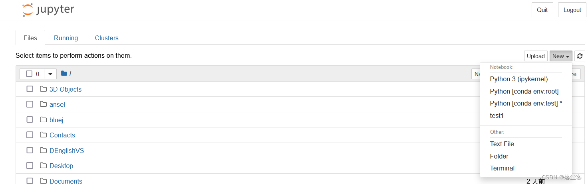
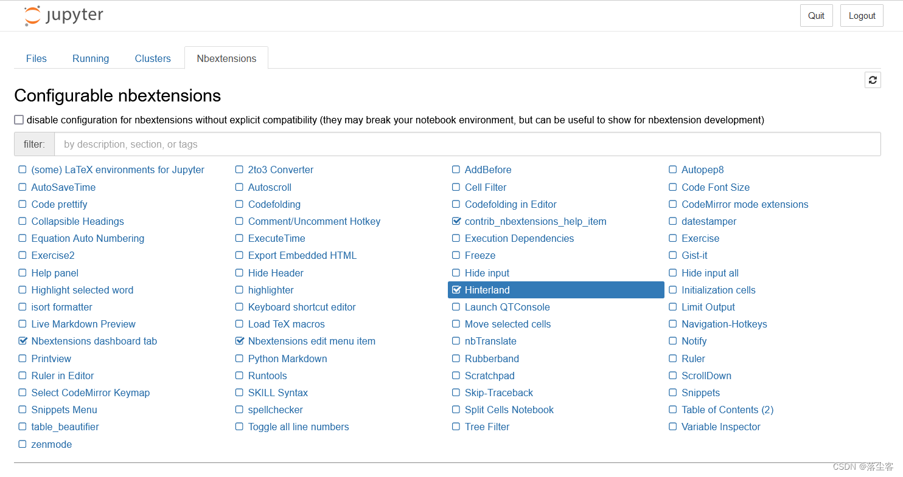
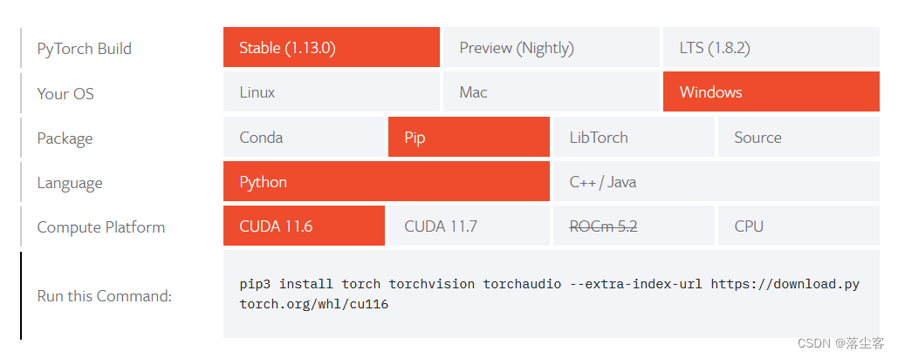
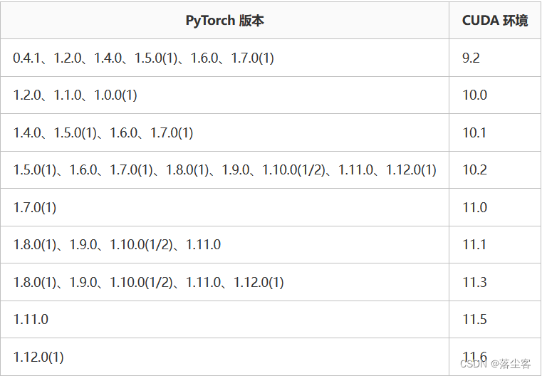

<!-- toc -->
深度学习环境搭建-windows10,使用镜像源、conda、pip配置torch、cuda环境
== 如果不想使用镜像源下载，直接使用vpn加速器也可以解决网速问题==
# 1.需要下载的工具
==安装过程可参考：https://blog.csdn.net/Thebest_jack/article/details/123455215==
## CUDA
在NVIDIA设置或网上查看电脑支持的cuda版本，并将显卡驱动更新至最新。
[CUDA官网](https://developer.nvidia.com/cuda-downloads)

## Anaconda
[Anaconda官网](https://www.anaconda.com)
若下载速度过慢可采用镜像源下载：https://mirrors.tuna.tsinghua.edu.cn/anaconda/archive/
## Jupyter
* jupyter是由ipykernel包发展得来，随Anaconda默认安装在base虚拟环境中，命令窗中使用jupyter notebook可以直接在浏览器中打开。
```
(base) C:\Users\luoweu>jupyter notebook
```
 若要在自行创建的虚拟环境中使用，还需要安装相应的包，先激活相应的环境：
方法1  安装命令与python解释器版本有关,安装后直接在当前环境中打开

```
#下列版本使用conda install nb_conda:
(test) C:\Users\luoweu>condA install nb_conda -c https://mirrors.tuna.tsinghua.edu.cn/anaconda/pkgs/main/
Specifications:
  - nb_conda -> python[version='>=2.7,<2.8.0a0|>=3.5,<3.6.0a0|>=3.8,<3.9.0a0|>=3.6,<3.7.0a0|>=3.7,<3.8.0a0']
  
Your python: python=3.9
#python3.9使用：
(test) C:\Users\luoweu>conda install nb_conda_kernels -c https://mirrors.tuna.tsinghua.edu.cn/anaconda/pkgs/main/

jupyter notebook
```
方法2  安装ipykernel，给当前虚拟环境命名，回到base环境中打开，可切换环境
```
conda install ipykernel -c https://mirrors.tuna.tsinghua.edu.cn/anaconda/pkgs/main/
#python -m ipykernel install --name “指定虚拟环境名” --display-name "想在jupyter中显示的名字”
python -m ipykernel install --name test --display-name test
```



### 打开代码自动补全功能 
激活对应环境：

```
pip install jupyter_contrib_nbextensions -i https://pypi.tuna.tsinghua.edu.cn/simple
jupyter contrib nbextension install --user
pip install jupyter_nbextensions_configurator -i https://pypi.tuna.tsinghua.edu.cn/simple
jupyter nbextensions_configurator enable --user
```

安装完成后，打开jupyter,在多出的一个菜单项设定即可：



### 完整显示每一行的输出结果

```
#让jupyterx显示一个代码块的完整结果，而不是仅显示最后一行结果
from IPython.core.interactiveshell import InteractiveShell
InteractiveShell.ast_node_interactivity = "all"
```

## Pycharm
按照操作教程来安装即可,官网下载速度慢：
>百度网盘丨64位下载链接：
https://pan.baidu.com/s/1RaZJicGGUhBFCEh1Jy12lw
提取码：a66w
## Pytorch
### 使用镜像源安装
```
conda config --add channels https://mirrors.tuna.tsinghua.edu.cn/anaconda/cloud/pytorch/
https://pypi.tuna.tsinghua.edu.cn/simple#pip安装源，需要找一下
```

###  使用pip安装
弄清楚自己的cuda版本和显卡信息，匹配对应的pytorch,进入[pytorch官网](https://pytorch.org/get-started/locally/),生成对应的命令，实测pip比conda下载快的多。


```
pip3 install torch torchvision torchaudio --extra-index-url https://download.pytorch.org/whl/cu116
# 若下载速度过慢，末尾加上镜像源： -i https://pypi.tuna.tsinghua.edu.cn/simple some-package
conda install pytorch torchvision torchaudio pytorch-cuda=11.6 -c pytorch -c nvidia
#同理，加上：-c https://mirrors.tuna.tsinghua.edu.cn/anaconda/cloud/pytorch/
```

# 2.命令工具的使用
## conda

```
#改变conda虚拟环境的默认路径
conda config --add envs_dirs newdir #增加环境路径newdir
#创建一个环境并且创建在python3.9下（可修改python版本
conda create -n name python=3.9
#指定位置新建虚拟环境
conda create --prefix=/home/conda_env/mmcv python=3.7
#创建一个环境并且在创建时自动安装yml文件中的库
conda env create -n name -f environment.yml
#查看已经安装的环境(以下两条输出相同)
conda-env list
conda info --envs
# 激活环境
conda activate name
# 关闭环境
conda deactivate name
#删除该虚拟环境
conda remove --prefix=/home/conda_env/mmcv --all

#安 装 / 卸 载 / 更 新   包
conda install 包名 -c 源地址
conda uninstall 包名
conda update 包名
#需要注意的是，部分包在安装时的名字和我们所熟知的并不完全相同，具体可查百度
conda update conda # 检查并更新到conda最新版本
conda update --all # 更新所有的安装包
# 删除没有用的包
conda clean -p
# 删除tar打包
conda clean -t
# 删除无用的包和缓存
conda clean --all

```

## pip

```
安装pip自身
不存在pip

安装pip
python -m ensurepip
已有pip

升级pip
python -m pip install -U pip

安装指定版本的pip
python -m pip install pip==[version]
示例：python -m pip install pip==20.2.4
安装其它包

安装包
pip install [package]

安装指定版本的包
pip install [package==version]

升级包
pip install -U [package]
pip install --upgrade [package]

卸载包
pip uninstall [package]

指定单次安装源
pip install [package] -i [source]

安装requirements.txt文件中的所有包
pip install [-U] -r requirements.txt

将包导出requirements.txt
pip freeze > requirements.txt
其它命令

查看pip版本
pip -V
pip --version

获取帮助
pip -h
pip --help

搜索包
pip search [package]

查看指定包的详细信息，包含版本号
pip show [-f] [package]

列出已安装的包及其版本号
pip list
pip freeze

查看可升级的包
pip list -o
```

# 3.镜像源的选择
## conda

```
# 查看镜像源
conda config --show-sources 
 
# 从channel中安装包时显示包的来源
conda config --set show_channel_urls yes
 
# 安装时默认选择Yes，就不需要每个次都自己再Yes了
conda config --set always_yes yes
 
=========================================================================================
# 清华源——仓库
conda config --add channels https://mirrors.tuna.tsinghua.edu.cn/anaconda/pkgs/free/
conda config --add channels https://mirrors.tuna.tsinghua.edu.cn/anaconda/pkgs/main/
 
# 清华源——第三方源
conda config --add channels https://mirrors.tuna.tsinghua.edu.cn/anaconda/cloud/simpleitk
conda config --add channels https://mirrors.tuna.tsinghua.edu.cn/anaconda/cloud/pytorch-lts
conda config --add channels https://mirrors.tuna.tsinghua.edu.cn/anaconda/cloud/pytorch
conda config --add channels https://mirrors.tuna.tsinghua.edu.cn/anaconda/cloud/menpo
conda config --add channels https://mirrors.tuna.tsinghua.edu.cn/anaconda/cloud/msys2s
conda config --add channels https://mirrors.tuna.tsinghua.edu.cn/anaconda/cloud/conda-forge
conda config --add channels https://mirrors.tuna.tsinghua.edu.cn/anaconda/cloud/bioconda

# 清除索引，在更新源后建议清除一下索引
conda clean -i 
 
添加镜像源地址参数-i
conda install python -i 后加镜像地址
 
# 删除镜像源
conda config --remove channels  https://XXXXXXXXXXXX
# 换回默认镜像源
conda config --remove-key channels
修改链接超时时间和读取超时时间
conda config --set remote_connect_timeout_secs 40
conda config --set remote_read_timeout_secs 100
```

## pip
配置镜像源可以简单的在pycharm的设置里配置，这里记录了一些命令窗口中可以用到的命令

```
#使用镜像源提高下载的速度（这里用清华镜像源）
pip intall package_name -i https://pypi.tuna.tsinghua.edu.cn/simple
#常用镜像源
清华：https://pypi.tuna.tsinghua.edu.cn/simple
阿里云：http://mirrors.aliyun.com/pypi/simple/
中国科技大学 https://pypi.mirrors.ustc.edu.cn/simple/
华中理工大学：http://pypi.hustunique.com/
山东理工大学：http://pypi.sdutlinux.org/
豆瓣：http://pypi.douban.com/simple/
```

# 4.安装和注意事项
* CUDA版本、GPU显卡、pytorch版本应该匹配，分别可在NVIDIA设置、官网可以查到。

* Anaconda的版本决定着虚拟环境中可以安装的python解释器最高为多少。
* 在anaconda安装软件包时默认源过慢可选择镜像源，但最好不要将镜像源直接加入配置文件。
* 使用conda安装第三方库和pip\pip3安装第三方库的速度可能不一样
* 在安装软件和创建虚拟环境等时多注意安装位置，尽量不选在C盘
